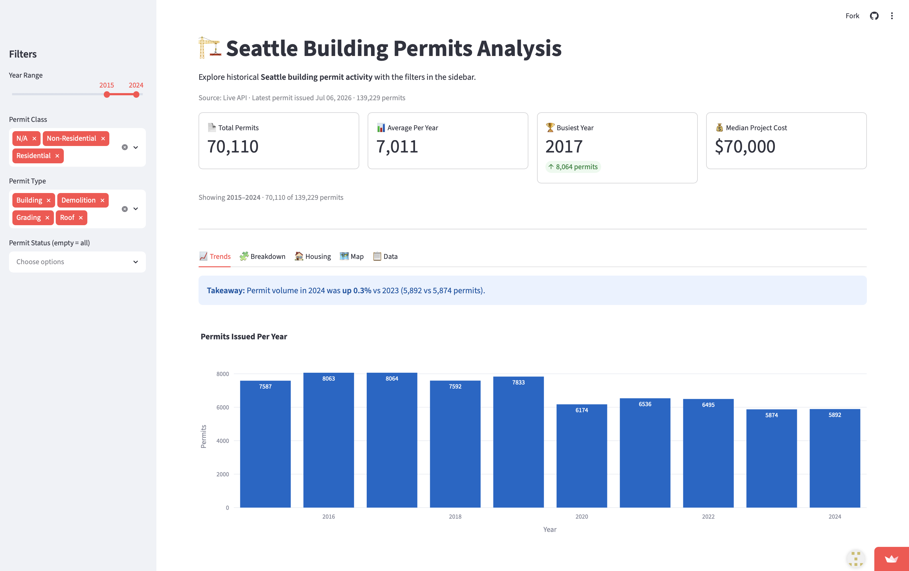

# 🏗️ Seattle Building Permits Analysis

An interactive Streamlit dashboard analyzing 20+ years of Seattle construction activity, built on live data from the City of Seattle's Open Data API.

**Live demo:** [seattle-building-permits.streamlit.app](https://seattle-building-permits-djrvb3zjo9cqf9temkqrht.streamlit.app)



## What it does

The app pulls the full building permits dataset (180,000+ records) directly from Seattle's Socrata API, so it always reflects the latest published data — no manual downloads. Users can filter by year range, permit class, permit type, and status, then explore five views: yearly and monthly issuance trends, residential vs non-residential breakdowns with median project costs, housing units added vs removed, an interactive map of permit locations, and a searchable data table where every row links to the official city permit record.

## Key findings (2015–2024)

- Seattle permits added **114,113 housing units** and removed **7,318** — a net gain of **~106,800 units**. The strongest year was **2021 (+17,990 net units)**.
- Permit volume peaked in **2017 (~8,050 permits)** and has not recovered: 2024 volume (~5,850) sits roughly **27% below the peak**, with the sharpest drop after 2019.
- The median permitted project is modest — about **$70,000** in estimated cost — while the mean (~$1.3M) is inflated by a small number of mega-projects, including one $25B outlier.

## Technical highlights

- **Live API integration** — paginated SoQL queries against the Socrata endpoint, fetching only the 12 columns used; falls back to a local CSV if the API is unreachable
- **Caching** — `st.cache_data` with a 24h TTL, so the dataset is fetched once a day instead of on every interaction
- **Data quality handling** — 27% of records lack an issue date (excluded), project costs use medians to resist extreme outliers, null permit classes are surfaced rather than dropped
- **Version-aware UI** — detects the installed Streamlit/Plotly versions and degrades gracefully (e.g., interactive MapLibre map with a fallback to `st.map`)

## Tech stack

Python · Streamlit · pandas · Plotly · Seattle Open Data (Socrata) API

## Run it locally

```bash
git clone https://github.com/Chealz/seattle-building-permits.git
cd seattle-building-permits
bash setup.sh
```

The script finds your newest Python (3.10+ required), creates a virtualenv, installs dependencies, and launches the app. First load takes ~30–60s while the full dataset downloads; after that it's cached.

## Data source

[City of Seattle Open Data Portal — Building Permits](https://data.seattle.gov/d/76t5-zqzr) (dataset `76t5-zqzr`), refreshed daily by the city.
